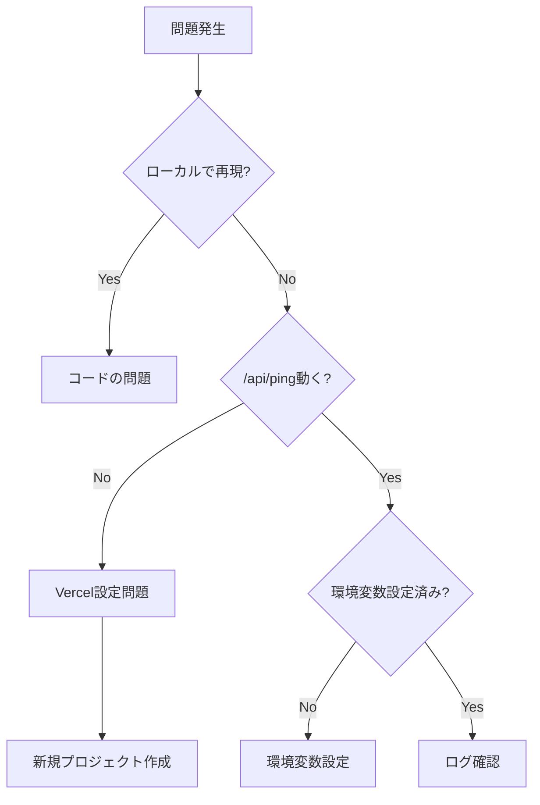

# 📚 Vercel × LINE Bot 完全ナレッジベース

## 目次
1. [今日遭遇した全問題と解決策](#今日遭遇した全問題と解決策)
2. [Vercelの罠と対策](#vercelの罠と対策)
3. [LINE Bot特有の注意点](#line-bot特有の注意点)
4. [デプロイ戦略](#デプロイ戦略)
5. [緊急時の対処法](#緊急時の対処法)

---

## 今日遭遇した全問題と解決策

### 問題1: /api/* が全て404を返す
**原因**: Vercelが静的サイトとして認識していた
**解決策**: 
```bash
# 新規プロジェクトを作成
mkdir new-project
cd new-project
echo '{}' > vercel.json  # 空オブジェクト重要！
echo '{"name":"project","version":"1.0.0"}' > package.json
```
**学習**: Framework Preset は必ず "Other" を選択

### 問題2: 環境変数が反映されない
**原因**: デプロイ時にのみ読み込まれる
**解決策**: 
```bash
vercel env add KEY_NAME production
vercel --prod  # 再デプロイ必須
```
**学習**: 環境変数変更後は必ず再デプロイ

### 問題3: デプロイ回数制限に到達
**原因**: 無料プラン100回/日の制限
**解決策**: 
- ローカルで完璧にしてからデプロイ
- 複数変更をまとめる
- console.logを戦略的に配置
**学習**: デバッグは計画的に

### 問題4: LINE Webhook検証が通らない
**原因**: 404や500を返していた
**解決策**:
```javascript
// 必ず200を返す
export default async function handler(req, res) {
  try {
    // 処理
  } catch (error) {
    // エラーでも200
    return res.status(200).json({ ok: true });
  }
}
```
**学習**: LINEは常に200を期待

---

## Vercelの罠と対策

### 罠1: 自動Framework検出
```json
// ❌ 悪い例
{
  "framework": "nextjs",  // 勝手に判定される
  "buildCommand": "npm run build"
}

// ✅ 良い例
{}  // 空オブジェクトが最強
```

### 罠2: ビルド設定の残留
**症状**: 設定を変更しても反映されない
**対策**: 
1. 新規プロジェクトが最速
2. または Settings → General → Reset

### 罠3: キャッシュ問題
**症状**: 古いコードが実行される
**対策**:
```bash
# Force rebuild
git commit --allow-empty -m "force rebuild"
git push
```

### 罠4: Functions が検出されない
**チェックリスト**:
- [ ] Framework Preset: Other
- [ ] Build Command: 空欄
- [ ] Output Directory: 空欄
- [ ] api/ ディレクトリが存在
- [ ] .vercelignore に api/ がない

---

## LINE Bot特有の注意点

### Webhook必須要件
```javascript
// 最小限のwebhook実装
export default async function handler(req, res) {
  // 1. 必ず200を返す
  res.status(200).json({ ok: true });
  
  // 2. 検証リクエストの処理
  if (body.events?.length === 0) {
    return;  // 空イベントはLINE検証
  }
  
  // 3. replyTokenの有効期限は1分
  // 即座に返信する必要がある
}
```

### 環境変数管理
```bash
# 必須
LINE_CHANNEL_ACCESS_TOKEN  # Messaging API token
LINE_CHANNEL_SECRET        # 署名検証用

# オプション
LIFF_ID                    # LIFF連携時
```

### エラーハンドリング
```javascript
// ❌ 悪い例
if (error) {
  res.status(500).json({ error });  // LINEが再送信してくる
}

// ✅ 良い例  
if (error) {
  console.error(error);  // ログに記録
  res.status(200).json({ ok: true });  // 200を返す
}
```

---

## デプロイ戦略

### 開発フェーズ別戦略

#### Phase 1: 初期開発（〜30デプロイ）
```bash
# 基本機能の動作確認
vercel dev  # ローカル確認
vercel      # プレビューデプロイ
# /api/ping 確認
vercel --prod  # 本番
```

#### Phase 2: 機能開発（30〜70デプロイ）
```bash
# 複数変更をまとめる
git add -A
git commit -m "Add multiple features"
vercel --prod  # 一括デプロイ
```

#### Phase 3: デバッグ（70〜90デプロイ）
```javascript
// デバッグエンドポイントを作る
// api/debug.js
export default (req, res) => {
  res.json({
    env: process.env,
    headers: req.headers,
    body: req.body
    // 一度で全情報取得
  });
};
```

#### Phase 4: 緊急時（90〜100デプロイ）
- ログを仕込んでから1回でデプロイ
- Vercel Dashboardから手動Redeploy
- 翌日まで待つ

### デプロイ前チェックリスト
```bash
#!/bin/bash
# deploy-check.sh

echo "🔍 Pre-deployment check..."

# 1. ローカルテスト
npx vercel dev &
sleep 5
curl -s http://localhost:3000/api/ping > /dev/null
if [ $? -eq 0 ]; then
  echo "✅ Local test passed"
else
  echo "❌ Local test failed"
  exit 1
fi

# 2. デプロイ回数チェック
echo "⚠️ Today's deploy count: Check manually in Vercel Dashboard"
echo "Continue? (y/n)"
read answer
if [ "$answer" != "y" ]; then
  exit 1
fi

# 3. デプロイ実行
vercel --prod
```

---

## 緊急時の対処法

### ケース1: API全滅（全て404）
```bash
# 最速復旧手順
1. mkdir emergency-fix
2. cd emergency-fix
3. echo '{}' > vercel.json
4. mkdir api && echo 'export default (r,s)=>s.json({ok:1})' > api/test.js
5. vercel --yes --name emergency-project
6. # Functions タブ確認
```

### ケース2: デプロイ制限到達
```javascript
// Vercel Dashboard → Functions → Logs
// ここでログを確認（デプロイ不要）

// または GitHub Actions 使用
// .github/workflows/deploy.yml
name: Deploy
on: 
  schedule:
    - cron: '0 0 * * *'  # 毎日0時
```

### ケース3: 環境変数が効かない
```bash
# 強制リセット
vercel env rm KEY_NAME -y
vercel env add KEY_NAME production
vercel --prod --force
```

### ケース4: キャッシュクリア必要
```bash
# Vercel Dashboard → Settings → Advanced
# "Purge Cache" ボタン

# またはCLI
vercel --prod --force --no-cache
```

---

## ベストプラクティス集

### 1. プロジェクト初期設定
```javascript
// 必須ファイル構成
project/
├── api/
│   ├── ping.js      // 疎通確認用（必須）
│   ├── health.js    // 詳細ステータス
│   └── webhook.js   // メイン処理
├── vercel.json      // {} だけ
├── package.json     // 最小限
└── .env.example     // 環境変数テンプレート
```

### 2. 安全なwebhook実装
```javascript
// api/webhook-safe.js
const safeHandler = (handler) => async (req, res) => {
  try {
    await handler(req, res);
  } catch (error) {
    console.error('Webhook error:', error);
    res.status(200).json({ ok: true, error: 'handled' });
  }
};

export default safeHandler(async (req, res) => {
  // 実際の処理
  const event = req.body?.events?.[0];
  // ...
  res.status(200).json({ ok: true });
});
```

### 3. デバッグ効率化
```javascript
// api/_middleware.js (全APIに適用)
export default function middleware(req, res, next) {
  console.log(`[${new Date().toISOString()}] ${req.method} ${req.url}`);
  next();
}
```

### 4. 環境別設定
```javascript
// utils/config.js
export const config = {
  isDev: process.env.VERCEL_ENV === 'development',
  isProd: process.env.VERCEL_ENV === 'production',
  isPreview: process.env.VERCEL_ENV === 'preview',
  
  // 環境別URL
  baseUrl: process.env.VERCEL_URL 
    ? `https://${process.env.VERCEL_URL}`
    : 'http://localhost:3000'
};
```

---

## チートシート

### Vercel CLI
```bash
vercel          # プレビューデプロイ
vercel --prod   # 本番デプロイ
vercel dev      # ローカル開発
vercel env ls   # 環境変数一覧
vercel logs     # ログ確認
vercel alias    # エイリアス管理
vercel rm       # デプロイ削除
```

### トラブルシューティングフロー


### 最終手段
```bash
# 完全リセット
rm -rf .vercel
rm vercel.json
echo '{}' > vercel.json
vercel --yes --force
```

---

## まとめ

### 今日の教訓TOP5
1. 🥇 **vercel.json は空 `{}` が最強**
2. 🥈 **Framework Preset: Other は初回設定で**
3. 🥉 **デプロイ回数は貴重なリソース**
4. 🏅 **ローカルテストには限界がある**
5. 🎖️ **LINEには必ず200を返す**

### 覚えておくべき数字
- 100回/日: デプロイ制限（無料）
- 6,000回/日: デプロイ制限（Pro）
- 10秒: Serverless実行時間制限（無料）
- 1分: LINE replyToken有効期限
- 200: LINE Webhookが期待するステータスコード

### 次のプロジェクトでは
1. このテンプレートを使用
2. 最初に/api/pingを確認
3. デプロイ戦略を立てる
4. 問題が起きたらこのナレッジを参照

**Remember**: Less is More, Simple is Best! 🚀